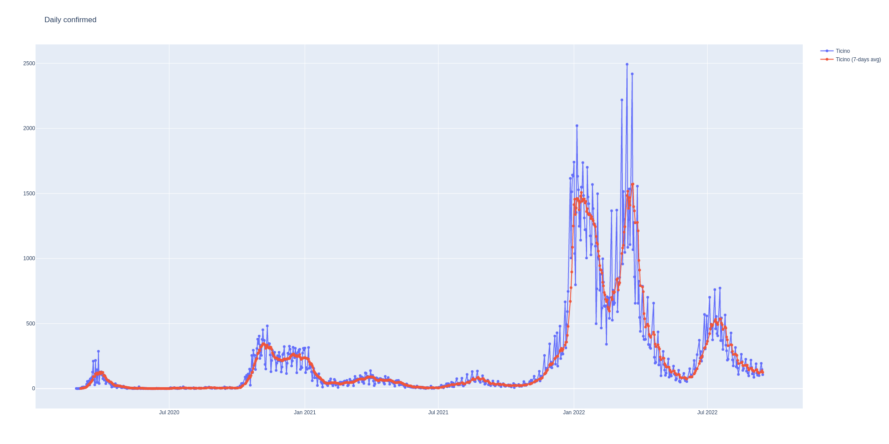
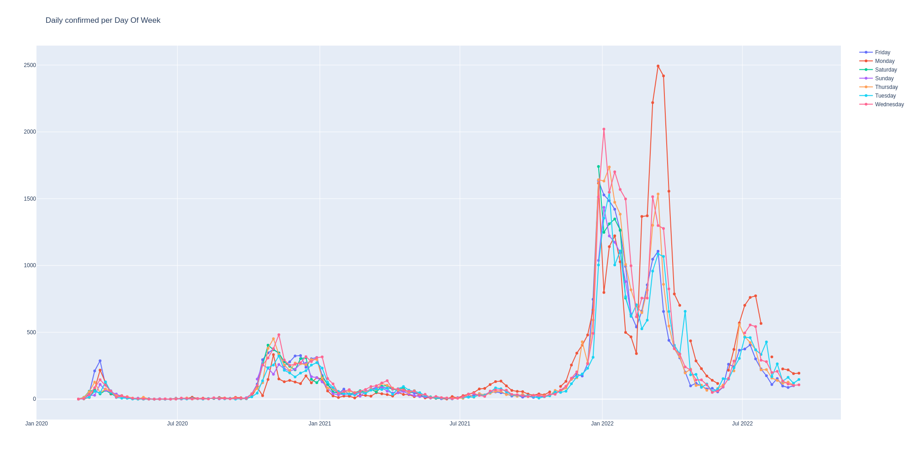
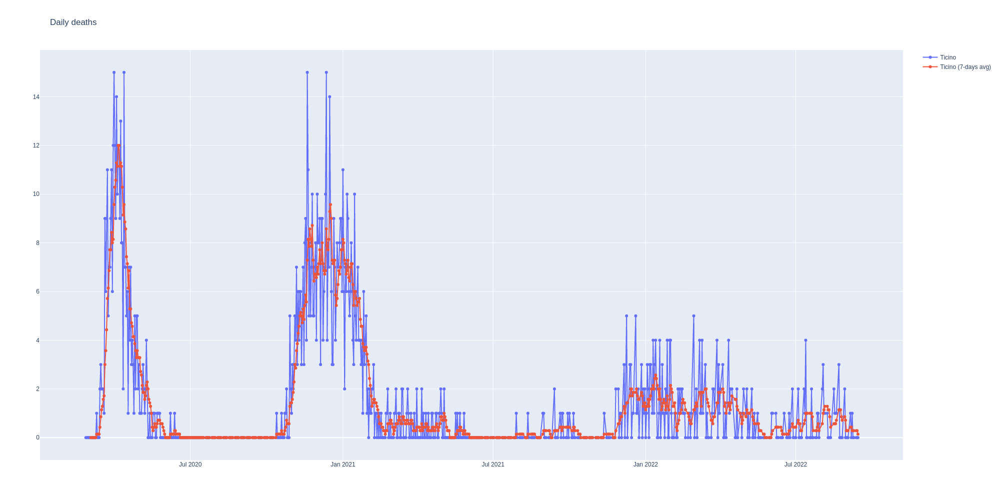

# SwitzerlandDataCOVID-19

Plot data on Switzerland COVID-19.

**Project status**: Work in Progress.


## Current situation in Ticino

**NOTE:** More plots in the _images_ folder.










## Get started

Display data:

```
    python main.py
```

All images are saved in _images_ folder.

## Source

Main source:
* [Specialist Unit for Open Government Data Canton of Zurich](https://github.com/openZH/covid_19)

Complementary sources:
* [Ticino DSS-DSP-Covid19](https://www4.ti.ch/dss/dsp/covid19/home/)
* [Wiki](https://en.wikipedia.org/wiki/2020_coronavirus_outbreak_in_Switzerland)
* [Swissinfo](https://www.swissinfo.ch/ita/epidemia_coronavirus--la-situazione-in-svizzera/45590960)


## License
This project is licensed under the MIT License - see the [LICENSE](LICENSE.md) file for details.
